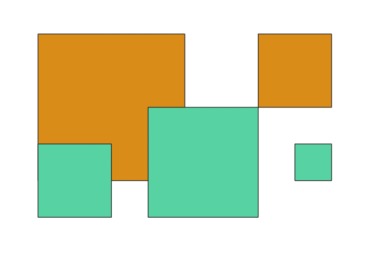
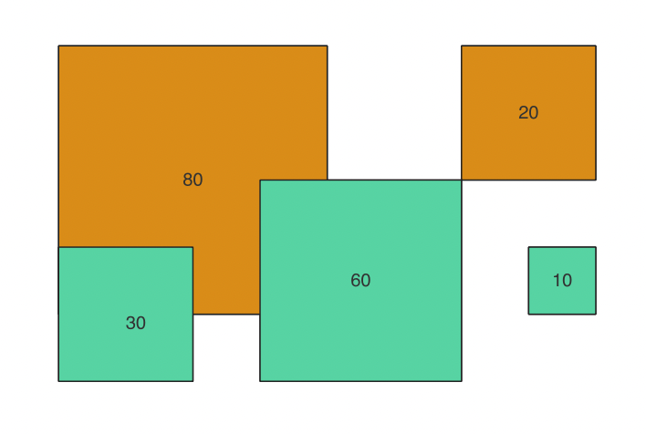
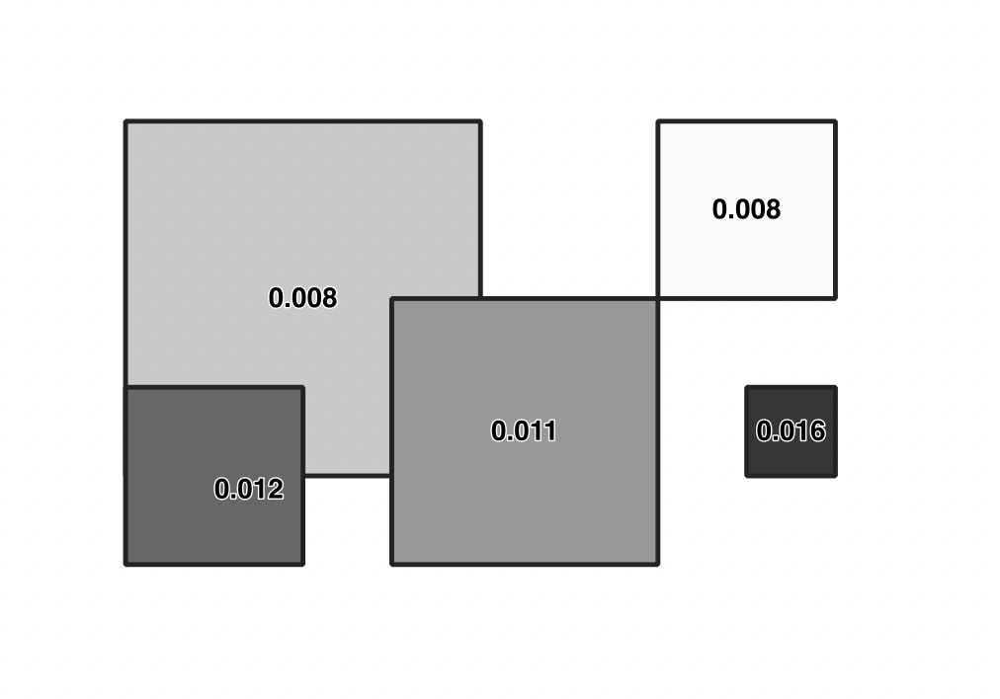
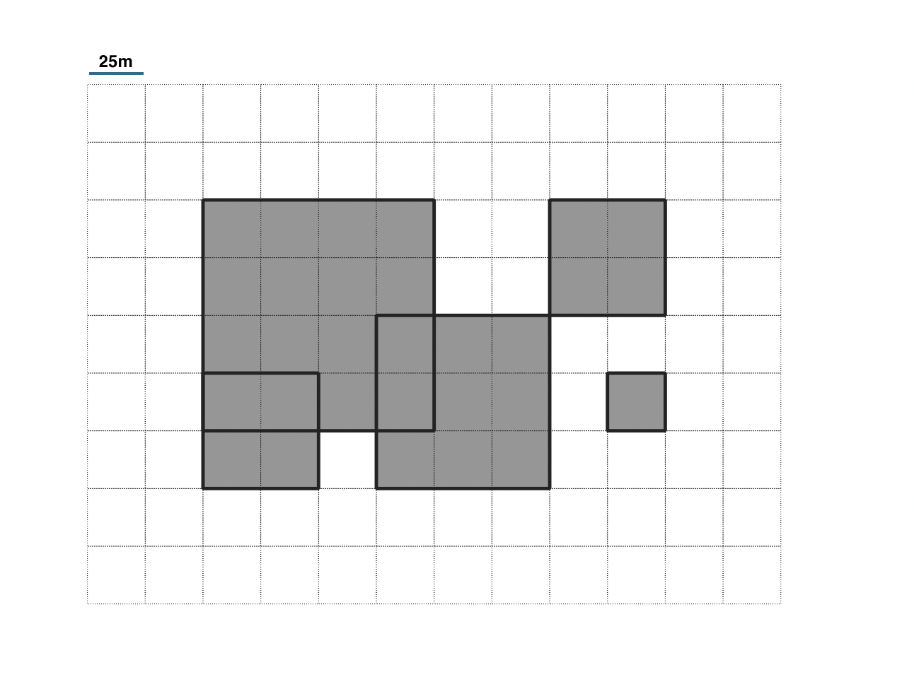
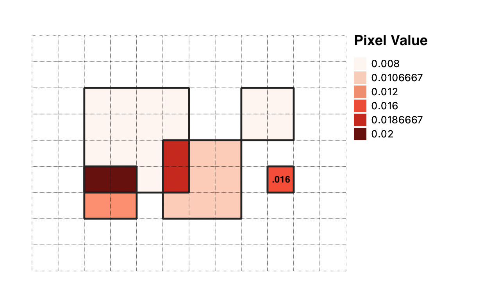

# Overview

`sapmap` takes the areas that a group identifies as important and combines them into a map of `spatial access priorities (img/SAP)`


This aggregate map is very useful in area-based planning exercises for identifying where important areas exist and measuring the impact if changes in access are made.  And it does this without identifying the individual respondents and which areas they contributed.  If the number of respondents is limited, then further measures may be needed to ensure that the data can't be reidentified.

Common questions these maps can answer include:
```
Which geographic areas are important to the group?  The most important?  The least important?

Is area A of more value to the group than area B?  How much more?

If the use of a given area is changed, will people be impacted?  How much of the groups value is within this area?
```

## Calculation

Overview of how the SAP algorithm works start to finish.

Assume two people draw areas important to them. Person one draws 2 polygons (in orange), and Person two draws 3 polygons (in green).



Each person has a total value of 100 that they distribute over those areas.



`sapmap` then calculates a Spatial Access Priority value for each polygon:
```
SAP value = importance / area
```

In this example, the polygon with an importance of 10 is 25 square meters per side or 625 square meters in area.  It's SAP value is calculated as:
```
10 / 625 = .016
```



The polygons are then `rasterized` or 'burned in' to a geospatial raster image (GeoTIFF).  Each pixel in a raster represents a square geographic area of consistent size.

In this example,  The pixels are 25 meters per side.



The SAP value of each pixel is then calculated as the sum of the SAP values of the overlapping polygons.  This can be displayed as a `heatmap` of importance.



The magnitude of the SAP value for each pixel is not important, only its value in relation to other pixels, and the portion of the overall value it represents.

Notice that the polygon that had an importance of 10 yields a pixel with a SAP value of 1.  This is due to it having a relatively large importance for its small area.  The sum of all pixel values is 5, so this one pixel represents 20% of the overall value or importance.
